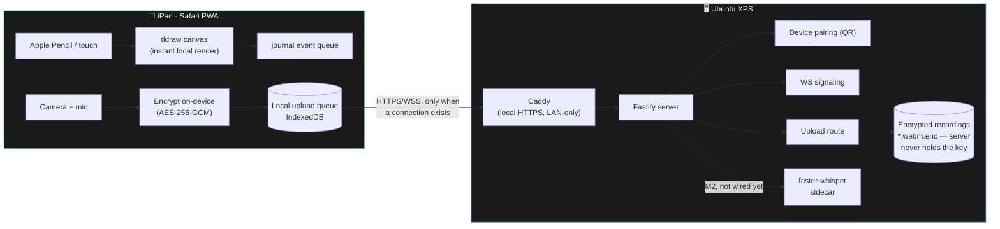

<div align="center">

# inkboard

**Draw and teach on an iPad, record a facecam, get semantic data back — not a video file.**

[](LICENSE)
[](https://github.com/KevinTrinhDev/inkboard/actions/workflows/ci.yml)
[](.nvmrc)
[](pnpm-workspace.yaml)

</div>

---

> **Status:** early-stage personal project. This README covers the current
> milestone — see [docs/ROADMAP.md](docs/ROADMAP.md) for what's next, or
> [docs/BACKLOG.md](docs/BACKLOG.md) for the running list of performance/
> security/UI-UX improvements layered on top of it.

## What this is

inkboard turns an iPad + Apple Pencil into a teaching-board recorder: ink,
text, and math render instantly on the board while a facecam records you
talking, and the two combine into a finished tutorial video. The trick is
**the board is never a bitmap** — every stroke, text box, and equation is
stored as a typed object, and video is only ever generated from that data at
export time, never the other way around.

```
TEXT   "Newton's Second Law"
MATH   latex: "F = ma"
ARROW  points: [...]
INK    points: [...]  pressure: [...]
```

That one decision is why the board can be re-rendered at any resolution,
re-skinned with a different handwriting style later, translated into other
languages, or even driven by an AI agent instead of a human hand — without
ever touching a video frame. Full rationale in
[docs/ARCHITECTURE.md](docs/ARCHITECTURE.md).

## Highlights

| | |
|---|---|
| 🖊️ **Instant ink** | Apple Pencil strokes render locally the instant they're drawn — never waiting on a network round trip. |
| 📴 **Offline-first recording** | Recording depends on local pencil/camera/mic/disk only, never on Wi-Fi. A finished take queues on-device and syncs automatically the moment a connection exists. |
| 🔒 **Encrypted at rest** | Recordings are AES-256-GCM encrypted *on the iPad* with a key that never leaves the device. The server only ever stores ciphertext it cannot decrypt. |
| 🏠 **LAN-only by design** | No cloud, no third party, ever. Traffic never leaves your home network, and the server is never internet-exposed. |
| 🧩 **Board as data** | Text, math, ink, and shapes are structured objects (`packages/shared-schema`), not pixels — resolution-independent, translatable, and agent-drivable. |

## How it works



- Ink has to feel instant under a Pencil, so it never waits on the network —
  it renders locally first, then replicates as a journal event.
- Recording is **offline-first**: the pre-flight checklist gates on
  pencil/camera/mic/disk, not on server connectivity. A finished take is
  encrypted and queued locally immediately; a background sync loop uploads
  it whenever the XPS is actually reachable (retry every 15s, plus instantly
  on reconnect).
- The only thing that ever crosses the network is ciphertext, over HTTPS/WSS,
  restricted to the LAN. See [docs/SECURITY.md](docs/SECURITY.md) for the
  full transport, pairing, and encryption-at-rest model.

## Quickstart (LAN dev setup)

Requires Node 22+, [pnpm](https://pnpm.io), and [Caddy](https://caddyserver.com)
installed on the machine that will act as the server.

```bash
pnpm install

# one-time: generate + trust Caddy's local CA, prints iPad trust instructions
./infra/scripts/setup-local-ca.sh

# one-time: restrict inbound traffic to your LAN subnet
sudo ./infra/scripts/setup-ufw.sh

# start Caddy + the server + the client dev build
./infra/scripts/dev-up.sh
```

Then on the iPad:
1. Trust the printed CA certificate (Settings → General → VPN & Device
   Management → install the profile → Certificate Trust Settings → enable).
2. Open `https://inkboard.local` (or your `CADDY_DOMAIN`) in Safari.
3. Scan the pairing QR code printed in the terminal with the Camera app.
4. Add to Home Screen for a standalone installed app.

Full detail: [docs/SECURITY.md](docs/SECURITY.md) (pairing/trust/encryption
model) and [infra/caddy/README.md](infra/caddy/README.md) (the cert flow
specifically).

### Everyday commands

| Command | What it does |
|---|---|
| `pnpm install` | Install all workspace dependencies |
| `pnpm typecheck` | Type-check every workspace package |
| `pnpm lint` | Lint the whole repo |
| `pnpm test` | Run the server test suite |
| `pnpm build` | Production build of client + server |
| `pnpm dev:server` / `pnpm dev:client` | Run one app in isolation |

## Repo layout

```
apps/
  client/            iPad-facing PWA — Vite + React + tldraw
  server/            Fastify server that runs on the LAN host
packages/
  shared-schema/     Board object / journal event schema, shared by client,
                     server, and the future agent API
services/
  whisper-sidecar/   faster-whisper CUDA sidecar (planned, M2)
infra/               Caddy config, firewall setup, dev scripts
docs/                Architecture, security, API, roadmap, backlog
```

## Documentation

| Doc | Covers |
|---|---|
| [docs/ARCHITECTURE.md](docs/ARCHITECTURE.md) | System design, every major decision and why |
| [docs/SECURITY.md](docs/SECURITY.md) | Threat model, pairing, transport, offline recording, encryption at rest |
| [docs/API.md](docs/API.md) | The board object schema and (future) agent-facing API |
| [docs/ROADMAP.md](docs/ROADMAP.md) | Sequential milestones (M0 → M5) |
| [docs/BACKLOG.md](docs/BACKLOG.md) | Cross-cutting performance/security/UX improvements |

## Security at a glance

inkboard is built for a trusted home LAN, not the public internet:

- **No cloud, ever.** Everything stays between your iPad and your own server.
- **LAN-only transport.** HTTPS/WSS via a local CA, firewalled to your subnet,
  never port-forwarded to the internet.
- **Device pairing, not "same Wi-Fi."** A one-time QR scan is the real
  authorization gate; being on the network alone proves nothing.
- **Offline-first.** Recording never depends on the network being up.
- **Encrypted at rest, client-side.** The encryption key is generated and
  stored only on the recording device and is never transmitted anywhere —
  the server stores ciphertext it cannot read.

See [docs/SECURITY.md](docs/SECURITY.md) for the full model, including the
explicit trade-offs (no key export/recovery exists yet) and what's
deliberately out of scope for a single-operator LAN tool. Found a real
vulnerability? See [SECURITY.md's reporting section](docs/SECURITY.md#reporting-a-vulnerability).

## Contributing

See [CONTRIBUTING.md](CONTRIBUTING.md) for local setup and conventions.

## License

MIT — see [LICENSE](LICENSE). Playpen Sans (used for handwriting-style text
rendering, from M5 onward) is bundled/referenced under its own OFL license.
