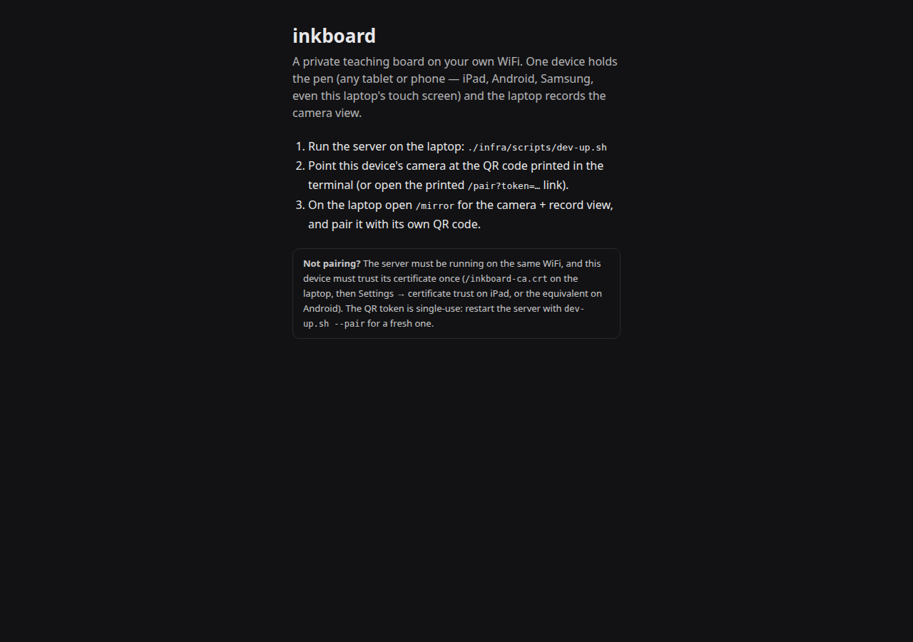
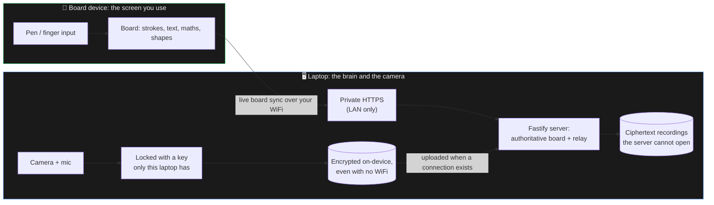

<div align="center">

# inkboard

**A private teaching whiteboard on your own WiFi — draw on any tablet, record the camera view from your laptop, and keep the board as data, not a video frame.**

[](LICENSE)
[](https://github.com/KevinTrinhDev/inkboard/actions/workflows/ci.yml)
[](.nvmrc)
[](pnpm-workspace.yaml)

<br />


<sub><i>The board device (iPad, Android tablet, or any touchscreen). Drawing tools only — it never asks for the camera. Screenshot of the running app.</i></sub>

</div>

---

## What it is

Two devices, one board.

- The **board device** is where you draw — an iPad with an Apple Pencil, a
  Samsung or Android tablet with its S Pen, a Chromebook, even a plain finger
  on any touchscreen. It shows the tools and nothing else: no camera prompt,
  no recording chrome in the way.
- The **laptop** runs the whole thing, holds the camera and mic, and opens
  `/mirror` to watch the board live while it records you.

Whatever you draw appears on the laptop as you draw it; a pasted image moves
the other way. Everything stays on your own WiFi — **no cloud, no account,
and the server is never exposed to the internet**.

The board is never a picture. Every stroke, word, and equation is saved as
*data* — `TEXT "F = ma"` or `MATH \frac{a}{b}`, not a photo of it — so a board
can be re-rendered at any size, searched, translated, or handed to an agent
later, without ever touching a video frame. (That semantic layer is the point
of the project: see [docs/ARCHITECTURE.md](docs/ARCHITECTURE.md).)

<div align="center">


<sub><i>The laptop's camera + record view (`/mirror`), watching the board live.
The camera preview is rendered with a test feed here.</i></sub>
</div>

## What you can do with it

- **Write with any pen** — Apple Pencil, S Pen, a generic stylus, or your
  finger. Input is pointer-agnostic; nothing is Apple-specific.
- **Type real text** — tap the text tool, tap the board, and type. Text is
  stored as a plain string, edits in place later.
- **Write real maths** — tap the math tool, type LaTeX, and see the live
  KaTeX preview before it lands on the board (`F = ma`, `E = mc^2`…).
- **Draw hand-drawn shapes and arrows** — rectangles, ellipses, lines and
  arrows with the sketchy look of a marker on a board.
- **Colour and weight** — pick ink colour and width for what you draw or the
  shapes you select.
- **Make the page yours** — each page can have a paper colour (paper, cream,
  mint, sky) and a guide pattern (plain, dot grid, ruled lines). The choice
  syncs to the other device like any board change.
- **Several pages per lesson** — flip back and forth and rename them
  (tap the page name in the toolbar).
- **Export your notes** — PNG of the current page, or hold the export button
  for a multi-page PDF. Share notes without waiting on a video pipeline.
- **Get your video out** — after a take, the laptop's **My takes** panel lists
  it; **Download video** decrypts it locally (the server never holds the key)
  into the original playable WebM/MP4, ready to watch, edit, or upload to
  YouTube.
- **Share the board, not the file** — anything you add shows up on the other
  device instantly; images paste/drop across devices too.

<details>
<summary><b>Pairing screen</b></summary>

<br />

<div align="center">

</div>

A brand-new device shows a short, three-step pairing card instead of a blank
screen. The QR codes are printed once per device by the server; pairing is
remembered after that.

</details>

## Quickstart

Requires Node 22+, [pnpm](https://pnpm.io), and [Caddy](https://caddyserver.com)
on the machine that acts as the server (a Linux laptop or a small always-on
box on your home network).

```bash
pnpm install
sudo apt install avahi-utils     # optional: makes inkboard.local resolve by name
pnpm go                          # starts everything
```

`pnpm go` generates a `.env` with a fresh signing secret if you don't have
one, builds only what changed, publishes `inkboard.local` on your LAN,
exports the HTTPS certificate, starts the server and Caddy, and prints one
pairing link per device.

Then pair each device **once**, from the printed links:

- **Board tablet** — open its pairing link (or scan its QR). The first time
  you trust your own server's certificate (below), then add the page to your
  Home Screen for a full-screen app.
- **Laptop** — open `/mirror` (or its pairing link) for the camera view.

**Pairing is remembered.** Every session after that is just `pnpm go`, then
tap the Home Screen icon and start drawing.

<details>
<summary><b>Which devices and pens work?</b></summary>

<br />

| You want to… | Works with | Notes |
|---|---|---|
| Be the board | iPad (iOS/iPadOS **≥ 18.4**), Android tablet/phone (Samsung, Pixel…), Chromebook, any touch laptop | 18.4 is the floor: before it, tldraw could crash Safari on some pen strokes and the screen-wake lock doesn't work in home-screen web apps |
| Use a pen | Apple Pencil, Samsung S Pen, any active/passive stylus, **or your finger/mouse** | Ink is pressure-sensitive where the hardware reports it; everything else just draws |
| Record the lesson | The laptop running the server (its built-in camera + mic) | Only one device ever touches the camera; the board never prompts for it |
| Share the view | Any second browser window | e.g. a student/guest page |

The CA-trust step below is per OS (iPad profile vs Android certificate), and
the drawing device itself needs no camera permission at all.

</details>

<details>
<summary><b>First time on a device: trusting your own certificate</b></summary>

<br />

inkboard serves real HTTPS from your machine, so each device has to be told
once that your machine's certificate authority is trustworthy.

- **iPad / iPhone:** open `https://inkboard.local/inkboard-ca.crt` in Safari,
  install the profile (**Settings → General → VPN & Device Management**),
  then turn on full trust under **Settings → General → About → Certificate
  Trust Settings**. Step 3 is a separate toggle from step 2 and is the one
  people miss.
- **Android / Chromebook:** download the same `.crt` and install it as a user
  certificate (**Settings → Security → Encryption & credentials → Install a
  certificate → CA certificate**).
- **The laptop's own browser:** just click past the warning once (or install
  the root cert into the OS trust store for a clean padlock).

If `inkboard.local` doesn't resolve, the server also serves your LAN IP over
HTTPS and prints it. Prefer the name: a hard-coded IP goes stale the moment
DHCP moves the machine.

</details>

<details>
<summary><b>Why is there a "made with tldraw" watermark?</b></summary>

<br />

inkboard is built on the [tldraw](https://tldraw.dev) SDK, whose license is
free for development but shows a small watermark in production unless you
carry a tldraw license key (free 100-day trial or a commercial key). Set
`VITE_TLDRAW_LICENSE_KEY` in `.env` to remove it. Everything else in this
project is MIT or OFL; see [LICENSE](LICENSE) and
[docs/REVIEW.md](docs/REVIEW.md) §5.1 for the details.

</details>

## How it works



- **The board is data.** Strokes, words and equations are typed objects with
  normalized coordinates (`packages/shared-schema`), rendered by tldraw and
  KaTeX — never baked pixels.
- **It survives reality.** The board is authoritative on the server, the iPad
  keeps a crash-safe local copy for drawing with no WiFi at all, and both
  sides reconnect on their own after sleep or a drop and hand over the
  current board. Nothing is lost.
- **Recordings never need WiFi**, are AES-GCM-encrypted in the browser before
  they touch disk anywhere, and the key never leaves the recording device:
  what the server stores is ciphertext it cannot open.
- **Nothing leaves your home network.** No cloud, no third party — even
  tldraw's icons and fonts ship inside the build, so the app works with the
  internet unplugged. The server binds to `127.0.0.1` and Caddy is the only
  door, firewalled to the LAN (see [docs/SECURITY.md](docs/SECURITY.md)).
- **It tells you when it's connected.** A status pill reads `Live`,
  `Connecting` or `Reconnecting` and counts devices; if another device holds
  the pen, yours says so and offers to take over instead of silently fighting
  for it.

Full write-up: [docs/ARCHITECTURE.md](docs/ARCHITECTURE.md) (design
decisions) and [docs/SECURITY.md](docs/SECURITY.md) (the full threat model).

## Screenshots

Real screenshots of the running app, regenerated with
`node scripts/screenshots.mjs` against a live server:

| | |
|---|---|
| [docs/media/ipad-board.png](docs/media/ipad-board.png) — the board with strokes, text, maths and shapes | [docs/media/laptop-mirror.png](docs/media/laptop-mirror.png) — the camera + record mirror |
| [docs/media/pairing-screen.png](docs/media/pairing-screen.png) — first-run pairing card | |

## Commands

| Command | What it does |
|---|---|
| `pnpm go` | Start everything. The only command a normal session needs |
| `pnpm go --pair` | Forget every paired device and print fresh QR codes |
| `pnpm go --build` | Force a rebuild even if nothing changed |
| `pnpm install` | Install everything |
| `pnpm typecheck` / `pnpm lint` / `pnpm test` / `pnpm build` | The verification gate: all four must pass before shipping |
| `node scripts/check-sync.mjs <log>` | Live correctness pass against a running server |
| `node scripts/stress-sync.mjs <log>` | Live load + edge-case pass ([scripts/README.md](scripts/README.md)) |
| `node scripts/screenshots.mjs` | Regenerate the README screenshots |
| `python3 scripts/make-icons.py` | Regenerate the app icons |

## Repo layout

```
apps/client/              the app both devices open (Vite + React + tldraw)
apps/server/              server that runs on the laptop (Fastify)
packages/shared-schema/   the shared data format both sides speak
infra/                    Caddy config, firewall setup, dev scripts
scripts/                  live checks, stress tests, screenshot capture
docs/                     everything below
```

## Documentation

| Doc | Covers |
|---|---|
| [ARCHITECTURE.md](docs/ARCHITECTURE.md) | System design and why each choice was made |
| [SECURITY.md](docs/SECURITY.md) | Full threat model, pairing, encryption, offline design |
| [API.md](docs/API.md) | The board data format and the (future) agent-facing API |
| [REVIEW.md](docs/REVIEW.md) | The 2026-09 codebase review: findings, sources, decisions |
| [ROADMAP.md](docs/ROADMAP.md) | What's built and what's next, in order |
| [IMPLEMENTATION-PLAN.md](docs/IMPLEMENTATION-PLAN.md) | Task-level plan with files and acceptance criteria |
| [HARDWARE.md](docs/HARDWARE.md) | Physical-device acceptance checklist |
| [BACKLOG.md](docs/BACKLOG.md) | Everything else worth doing, and why it's prioritized where it is |

Found a real vulnerability? See [SECURITY.md's reporting section](docs/SECURITY.md#reporting-a-vulnerability).

## Contributing

See [CONTRIBUTING.md](CONTRIBUTING.md).

## License

MIT, see [LICENSE](LICENSE). Playpen Sans (planned handwriting font, see
[ROADMAP](docs/ROADMAP.md)) ships under its own OFL license.
