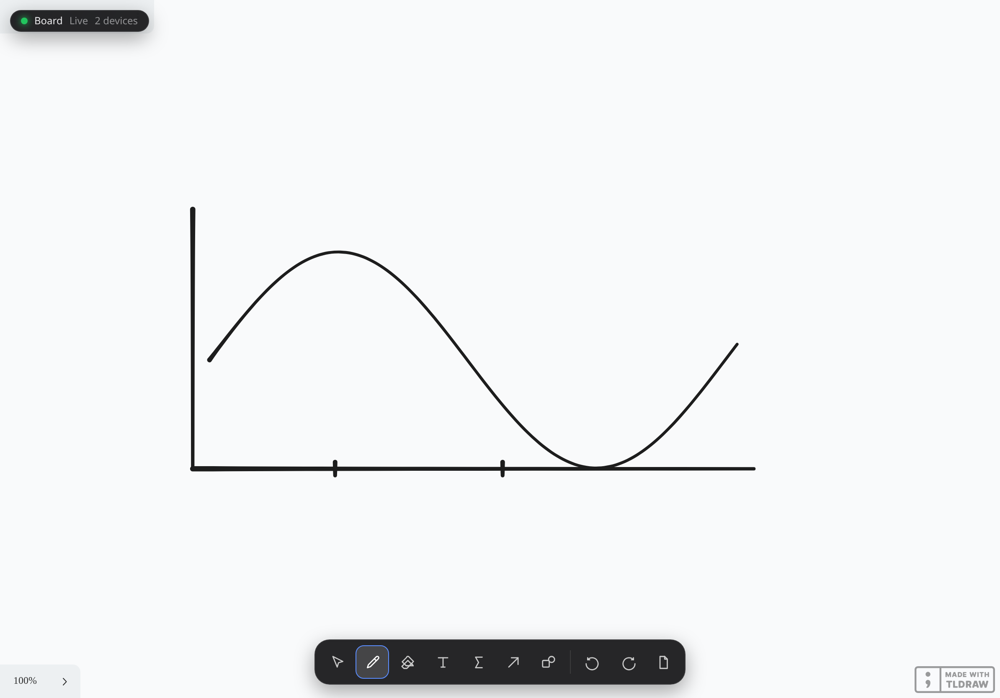
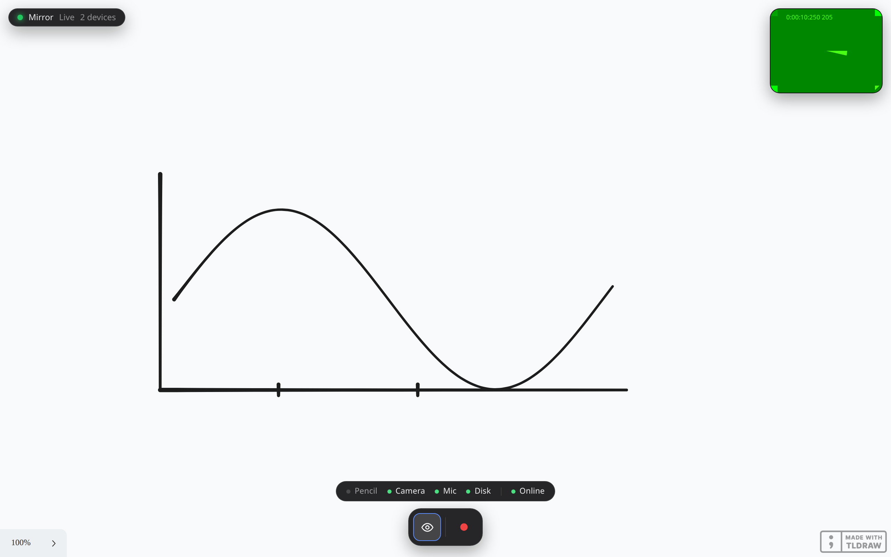
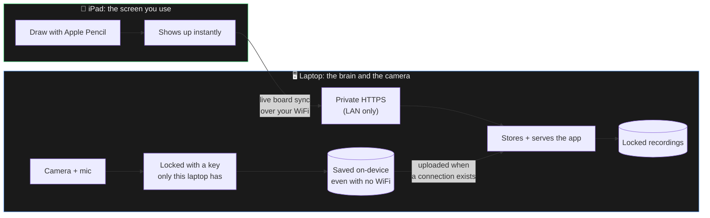

<div align="center">

# inkboard

**Draw and teach on an iPad, record a facecam, get semantic data back: not a video file.**

[](LICENSE)
[](https://github.com/KevinTrinhDev/inkboard/actions/workflows/ci.yml)
[](.nvmrc)
[](pnpm-workspace.yaml)

<br />



<sub><i>The iPad. Drawing tools only: it never opens the camera and has no record button, because the laptop owns capture.</i></sub>

</div>

---

## What it is

Two devices, one board.

- The **iPad** is the drawing surface. You write on it with Apple Pencil and
  nothing else: no camera prompt, no chrome in the way.
- The **laptop** runs the server, holds the camera and mic, and opens
  `/mirror` to watch the iPad's board live while it records you.

Whatever you draw on the iPad appears on the laptop as you draw it, and an
image pasted on the laptop shows up on the iPad. Everything stays on your own
WiFi; there is no cloud, and the server is never exposed to the internet.

The board itself is never a picture. Every stroke, word, and equation is
saved as *data* (`TEXT "F = ma"`, not a photo of "F = ma"), so it can be
redrawn at any size or style later without ever touching a video frame.

<div align="center">


<sub><i>The laptop, watching the same board live while it records. The green
rectangle top-right is the camera preview showing a test video source, not a
real webcam.</i></sub>
</div>

## Quickstart

Requires Node 22+, [pnpm](https://pnpm.io), and [Caddy](https://caddyserver.com)
on the machine that will act as the server.

```bash
pnpm install
sudo apt install avahi-utils   # so inkboard.local resolves from the iPad
pnpm go                        # starts everything
```

`pnpm go` generates a `.env` with a fresh signing secret if you don't have
one, builds only what changed, publishes `inkboard.local` on your LAN,
exports the HTTPS certificate, starts the server and Caddy, and opens the
laptop's camera view for you.

Then pair each device **once**, from the links it prints:

- **iPad** — scan the QR with the Camera app. First time only, you also
  install the local certificate: open `https://inkboard.local/inkboard-ca.crt`,
  continue past the warning (it *is* the cert you're about to trust), install
  the profile under **Settings → General → VPN & Device Management**, then
  turn it on under **Settings → General → About → Certificate Trust
  Settings**. That last toggle is separate and easy to miss. Then open
  `https://inkboard.local` and add it to your Home Screen.
- **Laptop** — the browser opens on its own, already on the pairing link.

**Pairing is remembered.** Every session after that is just:

```bash
pnpm go
```

…then tap the Home Screen icon on the iPad and start drawing. Use
`pnpm go --pair` when you actually want to add or replace a device.

> If `inkboard.local` doesn't resolve, the server also serves your LAN IP
> directly over HTTPS and prints it. Prefer the name: a hard-coded IP goes
> stale the moment DHCP moves the machine.

## How it works



- **Recording never needs WiFi.** A finished take is encrypted and saved
  locally first, then uploaded whenever a connection exists.
- **The server never sees your recording unencrypted.** The key lives only in
  the recording device's browser: what lands on disk is ciphertext.
- **Nothing ever leaves your home network.** No cloud, no third party. Even
  tldraw's icons and fonts are bundled into the build rather than fetched
  from its CDN, so the app works with the internet unplugged.

A status pill in the top-left of both devices says whether they are actually
talking to each other (`Live`, `Connecting`, `Reconnecting`) and how many
devices are connected. If a device sleeps or WiFi drops it reconnects on its
own and is handed the current board, so nothing is lost.

To put an image on the board, paste or drop it on either device. It uploads to
the server once and appears on the other device.

Full write-up: [docs/ARCHITECTURE.md](docs/ARCHITECTURE.md) (design decisions)
and [docs/SECURITY.md](docs/SECURITY.md) (the full threat model).

## Commands

| Command | What it does |
|---|---|
| `pnpm go` | Start everything. The only command a normal session needs |
| `pnpm go --pair` | Same, but forget every paired device and print a fresh QR |
| `pnpm go --build` | Same, but force a rebuild even if nothing changed |
| `pnpm install` | Install everything |
| `pnpm typecheck` / `pnpm lint` / `pnpm test` / `pnpm build` | The verification gate: all four must pass before shipping |
| `node scripts/check-sync.mjs <log>` | Live correctness pass against a running server |
| `node scripts/stress-sync.mjs <log>` | Live load and edge-case pass ([scripts/README.md](scripts/README.md)) |
| `python3 scripts/make-icons.py` | Regenerate the app icons |

## Repo layout

```
apps/client/              the app both devices open (Vite + React + tldraw)
apps/server/              server that runs on the laptop (Fastify)
packages/shared-schema/   the shared data format both sides speak
infra/                    Caddy config, firewall setup, dev scripts
docs/                     everything below
```

## Documentation

| Doc | Covers |
|---|---|
| [ARCHITECTURE.md](docs/ARCHITECTURE.md) | System design and why each choice was made |
| [SECURITY.md](docs/SECURITY.md) | Full threat model, pairing, encryption, offline design |
| [API.md](docs/API.md) | The board data format and the (future) agent-facing API |
| [ROADMAP.md](docs/ROADMAP.md) | What's built and what's next, in order |
| [BACKLOG.md](docs/BACKLOG.md) | Everything else worth doing, and why it's prioritized where it is |

Found a real vulnerability? See [SECURITY.md's reporting section](docs/SECURITY.md#reporting-a-vulnerability).

## Contributing

See [CONTRIBUTING.md](CONTRIBUTING.md).

## License

MIT, see [LICENSE](LICENSE). Playpen Sans (planned handwriting font, see
ROADMAP) ships under its own OFL license.
