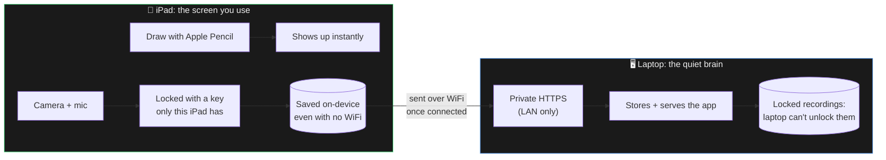

<div align="center">

# inkboard

**Draw and teach on an iPad, record a facecam, get semantic data back: not a video file.**

[](LICENSE)
[](https://github.com/KevinTrinhDev/inkboard/actions/workflows/ci.yml)
[](.nvmrc)
[](pnpm-workspace.yaml)

</div>

---

## What it is

Two devices, one board.

- The **iPad** is the drawing surface. You write on it with Apple Pencil and
  nothing else: no camera prompt, no chrome in the way.
- The **laptop** runs the server, holds the camera and mic, and opens
  `/mirror` to watch the iPad's board live while it records you.

Whatever you draw on the iPad appears on the laptop as you draw it, and an
image pasted on the laptop shows up on the iPad. Everything stays on your own
WiFi; there is no cloud, and the server is never exposed to the internet.

The board itself is never a picture. Every stroke, word, and equation is
saved as *data* (`TEXT "F = ma"`, not a photo of "F = ma"), so it can be
redrawn at any size or style later without ever touching a video frame.

## How it works



- **Recording never needs WiFi.** A finished take is locked and saved on the
  iPad first, then quietly sent to the laptop whenever a connection exists.
- **The laptop never sees your recording unlocked.** The lock key lives only
  on the iPad: theft or a compromised laptop only exposes ciphertext.
- **Nothing ever leaves your home network.** No cloud, no third party.

Full write-up: [docs/ARCHITECTURE.md](docs/ARCHITECTURE.md) (design decisions)
and [docs/SECURITY.md](docs/SECURITY.md) (the full threat model).

## Quickstart

Requires Node 22+, [pnpm](https://pnpm.io), and [Caddy](https://caddyserver.com)
on the machine that will act as the server.

```bash
pnpm install
./infra/scripts/setup-local-ca.sh   # one-time: generates the private HTTPS cert
sudo ./infra/scripts/setup-ufw.sh   # one-time: firewalls it to your LAN only
./infra/scripts/dev-up.sh           # starts everything
```

Then pair each device. Both can be paired at the same time; that is the
normal setup, not a workaround.

**iPad (the board).** Open `https://inkboard.local/inkboard-ca.crt` in Safari
and continue past the certificate warning, which is expected: that is the cert
you are about to trust. Install the profile under Settings → General → VPN &
Device Management, then turn it on under Settings → General → About →
Certificate Trust Settings. That last toggle is separate and easy to miss.
Then open `https://inkboard.local`, scan the pairing QR code shown in the
terminal, and add it to your Home Screen.

**Laptop (the camera and the live view).** Open `https://inkboard.local/mirror`
in a browser and pair it the same way. It shows the iPad's board read-only,
with the camera preview and the record button. Drawing is disabled there on
purpose: the iPad holds the pen.

A status pill in the top-left of both devices says whether they are actually
talking to each other (`Live`, `Connecting`, `Reconnecting`) and how many
devices are connected. If a device sleeps or WiFi drops it reconnects on its
own and is handed the current board, so nothing is lost.

To put an image on the board, paste or drop it on either device. It uploads to
the server once and appears on the other device.

Full steps: [docs/SECURITY.md](docs/SECURITY.md) and
[infra/caddy/README.md](infra/caddy/README.md).

| Command | What it does |
|---|---|
| `pnpm install` | Install everything |
| `pnpm typecheck` / `pnpm lint` / `pnpm test` / `pnpm build` | The full verification gate: all four must pass before shipping |
| `pnpm dev:server` / `pnpm dev:client` | Run one app on its own |

## Repo layout

```
apps/client/       the app both devices open (Vite + React + tldraw)
apps/server/       server that runs on the laptop (Fastify)
packages/shared-schema/   the shared data format both sides speak
infra/              Caddy config, firewall setup, dev scripts
docs/               everything below
```

## Documentation

| Doc | Covers |
|---|---|
| [ARCHITECTURE.md](docs/ARCHITECTURE.md) | System design and why each choice was made |
| [SECURITY.md](docs/SECURITY.md) | Full threat model, pairing, encryption, offline design |
| [API.md](docs/API.md) | The board data format and the (future) agent-facing API |
| [ROADMAP.md](docs/ROADMAP.md) | What's built and what's next, in order |
| [BACKLOG.md](docs/BACKLOG.md) | Everything else worth doing, and why it's prioritized where it is |

Found a real vulnerability? See [SECURITY.md's reporting section](docs/SECURITY.md#reporting-a-vulnerability).

## Contributing

See [CONTRIBUTING.md](CONTRIBUTING.md).

## License

MIT, see [LICENSE](LICENSE). Playpen Sans (planned handwriting font, see
ROADMAP) ships under its own OFL license.
